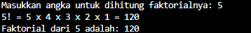

# Soal2SedangNo1
Sebelumnya, kita liat dulu deskripsi soalnya.

Seorang siswa RPL SMK Telkom Malang ingin menghitung faktorial dari suatu bilangan bulat positif yang dimasukkan. Buatlah sebuah program dalam bahasa Java untuk menghitung faktorial dari bilangan tersebut

So, kesimpulannya adalah membuat program penghitung faktorial.

Menurut saya mudah. Cuman, bagi anak-anak yang belum memahami function function secara baik dan benar mungkin susah. Karena mereka tidak tau bagaimana caranya (belum diajari). Sebenarnya, ini mudah. Yang membingungkan adalah, "bagaimana cara mengkalikan secara berurutan?" itu yang bikin bingung. Karena mereka tidak tau kalau bisa memakai for biasa dan yang diloop memakai "*=". Itu titik serunya.

Sekarang, waktunya membahas codingan saya. 
for (int i = 1; i <= angka; i++) {
  faktorial *= i;
}
System.out.println("Faktorial dari " + angka + " adalah: " + faktorial);

Ini merupakan cara kita menghitung faktorial. Hanya saja, dicodingan saya menambahkan jika orang input yang lain. 
if (angka < 0) {
            System.out.println("Kok malah negatif si, faktorialnya gak bisa didefinisikan broo.");
        } else if (angka == 0) {
            System.out.println("Oke, kau memilih 0. Sekalian aku beri funfact:");
            System.out.println("Faktorial dari 0 adalah 1.");
        } else {
            for (int i = 1; i <= angka; i++) {
            faktorial *= i;
        }
    }
        System.out.println("Faktorial dari " + angka + " adalah: " + faktorial);

Just like that. That is the **MAIN** function.

And i give how it works:
System.out.print(angka + "! " + "= "  );
        for (int i = angka; i >= 2; i--) {
            System.out.print(i + " x ");
        } if (angka > 0) {
            System.out.println("1 = " + faktorial);
        }

This is the screenshot of output program.

